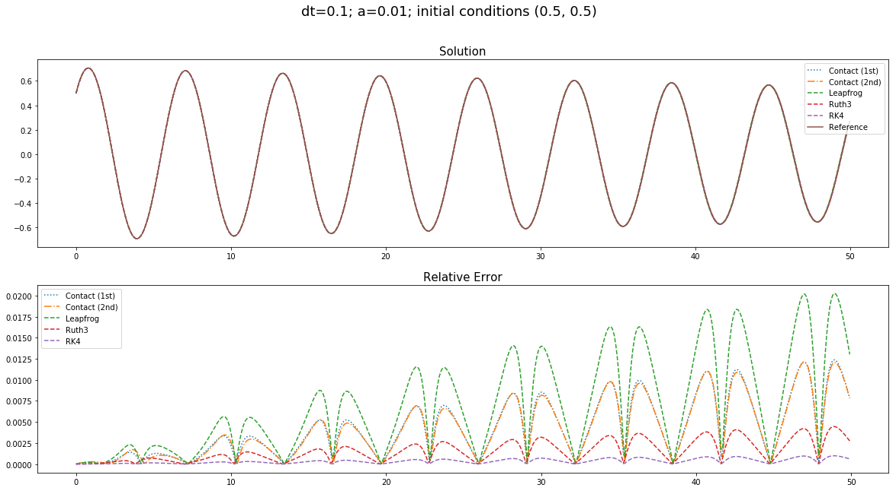
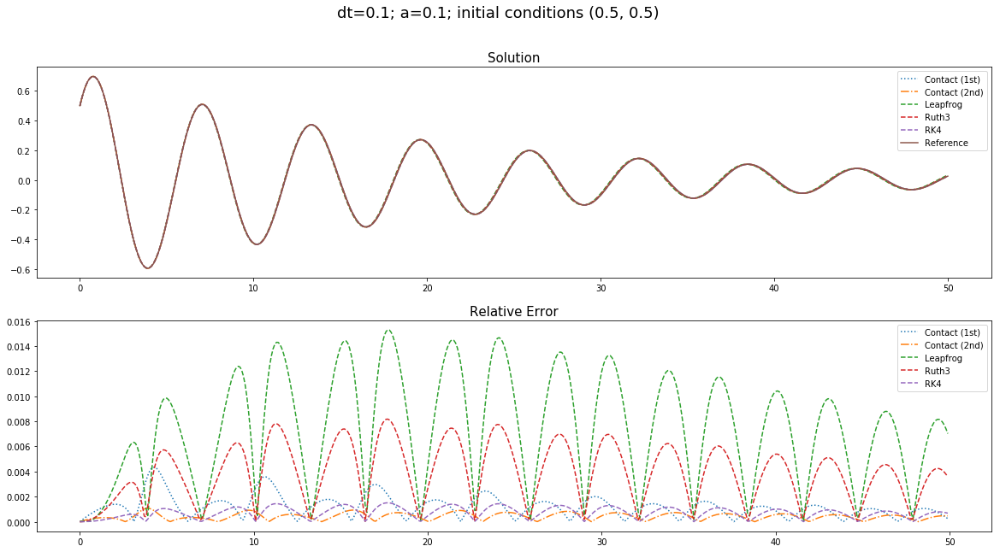
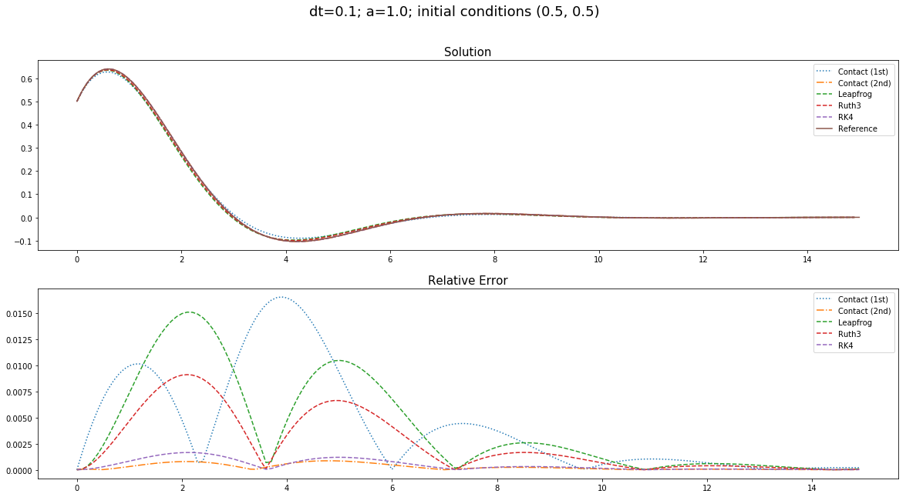
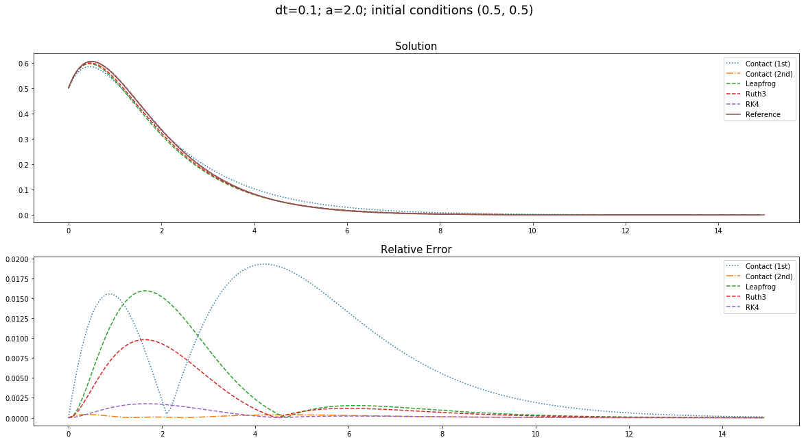

# Simulation code for Vermeeren, Seri, Bravetti: Contact Variational Integrators

The code can be run and adapted opening the `jupyter` notebook.
It requires having `numpy` and `matplotlib` installed.

The notebooks contains the code to generate the pictures used in the notebook. Namely:

